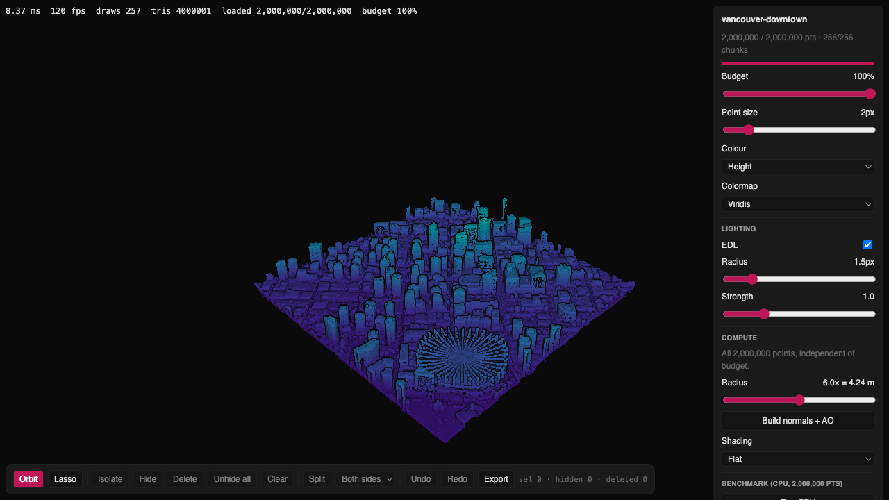
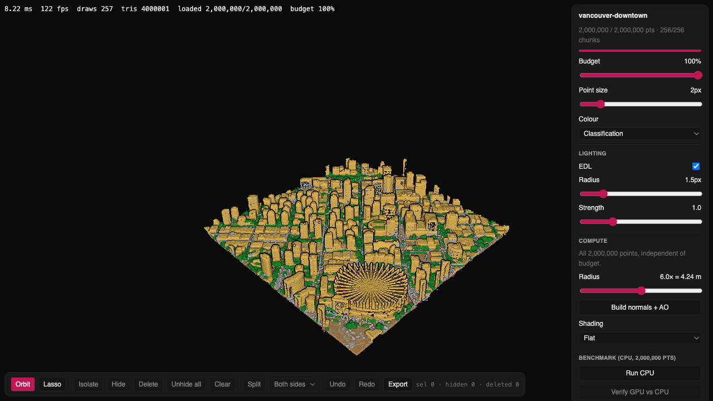
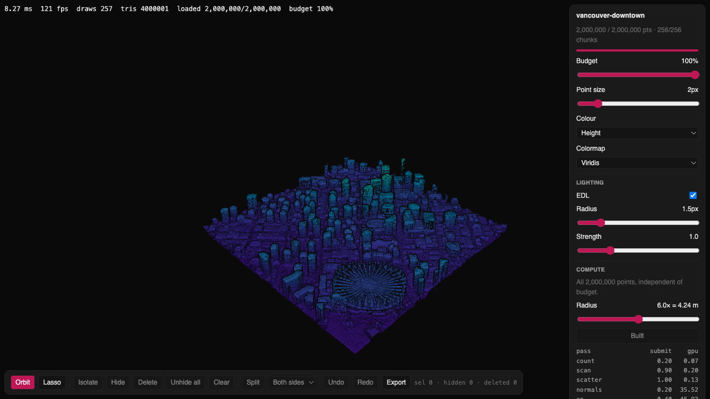
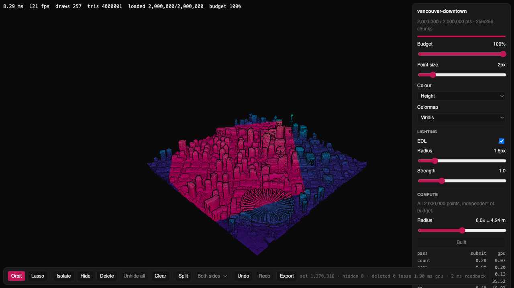
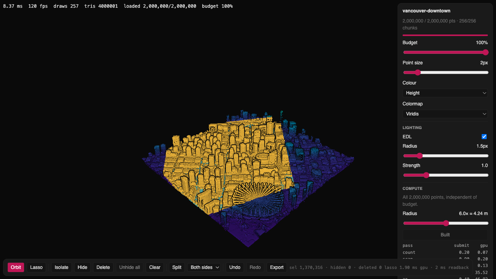

# Point Cloud Editor

[](docs/media/hero.webm)

<video src="docs/media/hero.webm" poster="docs/media/overview.png" autoplay loop muted playsinline controls width="100%">
  <source src="docs/media/hero.webm" type="video/webm">
  <source src="docs/media/hero.mp4" type="video/mp4">
</video>

Hero video: [`docs/media/hero.webm`](docs/media/hero.webm) ([mp4](docs/media/hero.mp4)).

A WebGPU point cloud viewer and editor for 2–20M-point LiDAR, written from scratch.
It streams the cloud into GPU storage buffers, then builds normals and ambient occlusion with WGSL compute.
You can select, hide, delete, split and export points on the GPU, and every performance number here comes from a committed bench file.

It started as a portfolio piece: can a browser handle a real city block of LiDAR, 20 million points, without an octree or a server? Here it can. One 1 km² downtown Vancouver tile, subsampled to 20M points, draws at 30 fps (60 fps at half the point budget), and its surface normals and AO take 1.2 s of GPU time on an M4 Max. Lasso and pick run as compute kernels over the same buffers the renderer draws from. It is built on three.js 0.186 (`three/webgpu`, TSL + raw WGSL), React Three Fiber 9 and a small Python preprocessing pipeline.

| | | |
|---|---|---|
|  |  |  |
|  |  | |

## Live

- **https://lab.merttoka.com/point-cloud** (Lab page with the viewer in an iframe)
- Standalone: https://point-cloud-editor.vercel.app/point-cloud/app/ (`?data=full` loads the 20M set, 160 MB)

Needs a browser with WebGPU (measured in Chrome 153); without it the page shows "WebGPU not available in this browser." Deploy order and why it matters: `docs/EMBEDDING.md` § Proxy / iframe › Deploy order.

## Controls
| Input | Action |
|---|---|
| drag / wheel | orbit / zoom (OrbitControls, +Z up; orbit tool only) |
| click | pick the nearest rendered point under the cursor (< 4 px pointer travel) → replace selection; miss clears it |
| `⇧` click / `⌥` click | add / subtract the picked point |
| `L`, drag | lasso tool: drag a polygon on the SVG overlay (simplified at 2 px; longer strokes decimated to ≤ 256 vertices), release → replace; `⇧` add, `⌥` subtract; double-click or `Esc` → orbit |
| `I` / `X` / `Delete` | isolate (hide everything else) / hide / delete the selection (or the chosen split side) |
| `U` / `C` | unhide all / clear selection |
| `S` | split: RANSAC + PCA plane through the selection, tags sides A / B (toolbar select `all / A / B` scopes the next op) |
| `⌘Z` / `⇧⌘Z` (`Ctrl` on Linux/Windows) | undo / redo |
| `F` | refit camera to dataset |
| `H` | toggle HUD |
| `\` (hold) | show the key list |
| toolbar (bottom-left) | Orbit / Lasso, Isolate, Hide, Delete, Unhide all, Clear, Split + side, Undo / Redo, Export; counts `sel · hidden · deleted`, last lasso `gpu / readback ms`, last `pick ms` |
| panel | point budget %, point size px, colour mode (height / intensity / class), colormap, EDL on/off, radius (1–4 px), strength (0–4), build normals + AO (radius 2–10 × spacing, default 6×), shading (flat / lit / lit + AO / normals debug), CPU benchmark, verify |
Keys work only while the viewer has focus (click it first) and are ignored from the panel's form controls. A centred progress card covers the load; it unmounts on ready.

### Editing
One flag byte per point (`hidden 1 · selected 2 · deleted 4 · splitA 8 · splitB 16`) lives in the 20 MB `flags` storage buffer the vertex stage already reads; a `Uint8Array` view of the same words is the CPU source of truth. Pick and lasso run as WGSL compute over the rendered prefix of every chunk (the budget slider decides what is pickable), lasso writes flags on the GPU and reads the whole buffer back into the mirror; isolate / hide / delete / split / undo mutate the mirror and upload the touched word range. Hidden and deleted points collapse to zero-size quads; selected points tint with the theme accent (`--pcv-accent`), split sides teal / orange. Undo ring: 30 commands or 256 MB of saved bytes, whichever first — a whole-buffer edit (lasso, isolate, unhide, split, hide/delete) saves N bytes, so ≈13 such edits at 20M; at 2M the 30-command cap binds first; picks save only the selection's index range.

### Export
Export writes `export.zip` = `manifest.json` + `points.bin` in the same v1 layout the loader reads (one chunk, deleted points dropped, hidden kept, bounds unchanged); compaction and zipping (`fflate`, stored) run in the loader worker. Re-open by unzipping into `public/data/<folder>/` and loading `http://localhost:5173/point-cloud/app/?data=<folder>` (`[a-z0-9-]+`; default `demo`) — a fresh page load, not an in-place dataset switch.

## Setup
```bash
npm install
npm run data:demo   # 2M demo set → public/data/demo/ (release asset, 16 MB)
npm run dev         # Chrome with WebGPU → http://localhost:5173/point-cloud/app/
npm test
npm run build
```

`.npmrc` sets `legacy-peer-deps=true`: @react-three/fiber@9.7.0 peer range (`react >=19 <19.3`) excludes pinned react@19.3.0.

Harness query params (dev, preview and deploy alike):

| param | effect |
|---|---|
| `?data=full` | load the 20M set (`npm run data:full` first); any `[a-z0-9-]+` folder under `public/data/`, default `demo` |
| `?bench=1` | expose the bench handle as `window.__pcv` (`scripts/bench.md`) |
| `?dpr=` | canvas pixel ratio override, clamped `[0.5, 4]` (default: device, clamped `[1, 2]`) |
| `?theme=dark\|light` | initial theme; a same-origin `postMessage({ type: 'pcv-theme', theme })` switches it later |

As a component: `<PointCloudViewer manifestUrl="/data/demo/manifest.json" theme="dark" />` (props: `theme`, `className`, `dpr`, `onApi`; see `docs/EMBEDDING.md`).

## Data

Demo (2M points, 16 MB) and full (20M, 160 MB) datasets are GitHub Release assets (`v0.1-data`):

```bash
npm run data:demo   # → public/data/demo/{manifest.json,points.bin}
npm run data:full   # → public/data/full/
```

Source: City of Vancouver LiDAR 2022, tile `491000_5458000` (downtown), UTM 10N metres, ~51 pts/m² (51.5M raw points per 1 km² tile).
Contains information licensed under the Open Government Licence – Vancouver (https://opendata.vancouver.ca/pages/licence/).
Switched from USGS 3DEP to Vancouver open data: every 3DEP candidate tile only carries baseline classes (no building/vegetation).
Release assets are served without CORS headers; the scripts download them and the viewer loads same-origin from `public/data/` (the Vercel build runs the same scripts; see ARCHITECTURE › Bench and deploy).

### Rebuilding from the raw tile

```bash
python3 -m venv tools/.venv && tools/.venv/bin/pip install -r tools/requirements.txt
tools/.venv/bin/python tools/fetch.py --list --near 491500 5458500        # tile names + URLs
# download https://webtransfer.vancouver.ca/opendata/2022LiDAR/491000_5458000.zip in a browser
# (the host serves a Cloudflare browser challenge to scripts)
tools/.venv/bin/python tools/fetch.py --import ~/Downloads/491000_5458000.zip --name vancouver-downtown
tools/.venv/bin/python tools/preprocess.py data/raw/vancouver-downtown.las data/processed/vancouver-downtown --stats
tools/.venv/bin/python tools/preprocess.py data/raw/vancouver-downtown.las data/processed/vancouver-downtown \
  --max-points 20000000 --demo 2000000 --cell-size 64
tools/.venv/bin/pytest tools/tests
```
Preprocess of the raw tile (51,494,885 points → 20M + 2M) takes 8.3 s on an M4 Max.

## Performance

Chrome 153 via Playwright MCP (headed), M4 Max, DPR 1, 2 px, 120 Hz display. Viewport 1277×860, production build on `vite preview`, measured 2026-09-25. Every number below comes from [`docs/bench/2026-09-25-m4max.json`](docs/bench/2026-09-25-m4max.json), one `runAll` row per dataset. The procedure is in `scripts/bench.md`. "10M" is the full set at a 50 % point budget.

| dataset | load ms | frame ms (fps), default → post-orbit | draws | EDL off / on ms | render GPU ms | compute GPU ms (wall) | lasso GPU / readback ms (selected) | pick ms, median of 5 |
|---|---|---|---|---|---|---|---|---|
| 2M | 246 | 8.37 (120) → 8.35 (120) | 257 | 8.33 / 8.34 | 6.95 | 81.9 (126) | 0.131 / 6.0 (1,914,126) | 1.4 |
| 10M | 334 | 16.94 (59) → 16.77 (60) | 257 | 16.72 / 16.09 | 25.49 | 1,238.5 (1,697) | 0.918 / 38.2 (9,571,790) | 25.3 |
| 20M | 316 | 33.19 (30) → 33.74 (30) | 257 | 34.12 / 33.73 | 52.82 | 1,217.4 (2,339) | 1.114 / 80.7 (19,143,782) | 113 |

- The 2M frame sits at the 120 Hz vsync floor (an empty rAF loop measures 8.30 ms), so neither the frame nor the EDL delta can be resolved there. At 10M and 20M, EDL on vs off is within run-to-run noise.
- Load time is from a warm HTTP cache on the local server, so it is not network time.
- Render GPU time is the sum of the render-pass timestamps (scene pass + EDL quad) of the frame after the call. At 10M/20M it exceeds the frame time; see ARCHITECTURE › Bench and deploy.
- Lasso uses a centred 50 % × 50 % square in replace mode. Its `selected` count equals the CPU reference (`cpuSelected`) in every row. Pick time is wall time and includes queue wait behind in-flight frames.

Compute build, GPU ms per pass (timestamp query), radius 6 × spacing (4.24 m on the demo, 1.34 m on the full set):

| pass | 2M | 10M | 20M |
|---|---|---|---|
| hash count | 0.197 | 1.049 | 1.114 |
| hash scan | 0.131 | 1.704 | 1.638 |
| hash scatter | 0.197 | 9.765 | 2.163 |
| normals (radius PCA) | 35.85 | 642.97 | 641.60 |
| ao | 45.48 | 583.01 | 570.88 |
| **total** | **81.85** | **1,238.50** | **1,217.40** |
| wall (sequential submits + timestamp resolves, between render frames) | 126.4 | 1,696.9 | 2,338.9 |

The 10M and 20M rows run the same build, because compute covers all 20M points whatever the budget. Their difference (scatter 9.8 vs 2.2 ms) is one sample each.

CPU reference on the 2M demo: the same algorithms run in the loader worker. hash 26.8 ms, normals 6,451.9 ms, ao 6,189.5 ms (12.7 s). Verify (GPU vs CPU): median 0°, max 32.27°, AO MAE 8.5 × 10⁻⁵, non-finite 0 (6,640 degenerate points). Verify runs on the demo only: above 2M the CPU bench uses a prefix subsample.

Memory after a build. The computed figure is the byte size of the GPU buffers (`memoryBytes` in `src/viewer/bench/handle.ts`; select-pipeline buffers are KB-scale and left out). The RSS proxy is the Chrome GPU-process RSS delta across the load and the run. That is unified memory, not VRAM:

| dataset | `qpos` | `flags` | `normals` | `ao` | hash | computed total | RSS proxy (`rssDeltaKB`) |
|---|---|---|---|---|---|---|---|
| 2M | 16.0 MB | 2.0 MB | 8.0 MB | 2.0 MB | 10.1 MB | 38.1 MB | 51,920 KB (53.2 MB) |
| 10M | 160.0 MB | 20.0 MB | 80.0 MB | 20.0 MB | 113.6 MB | 393.6 MB | 303,840 KB (311.1 MB) |
| 20M | 160.0 MB | 20.0 MB | 80.0 MB | 20.0 MB | 113.6 MB | 393.6 MB | 296,832 KB (304.0 MB) |

The 10M row allocates for all 20M points, since the budget only limits drawing. At 20M the RSS proxy reads below the computed total, so read it as an order of magnitude, not a bound.

## Architecture

- **Data**: `tools/preprocess.py` turns the raw LAS tile into a chunked `points.bin` (8 B/point, quantised) plus a `manifest.json`. Both are release assets, fetched by `scripts/fetch-data.mjs`.
- **Loading**: a module worker fetches chunks with HTTP `Range` and uploads them into one `qpos` storage buffer. Chunks render as they arrive, 256 sprite draws.
- **Rendering**: sprite quads in TSL (height / intensity / class colour, lit + AO shading) feed an EDL post pass. One `flags` byte per point drives hide/delete (collapsed quads) and selection tint.
- **Compute**: raw WGSL through `wgslFn`, in this order: spatial hash (count → scan → scatter), radius-PCA normals, tangent-plane AO. The CPU twin in the worker runs the bench and verify.
- **Editing**: pick and lasso are compute kernels over the rendered prefix. Isolate/hide/delete/split/undo mutate a CPU mirror of `flags` and upload the touched range. Export writes a zip in the loader's own format.

Details, measured findings and the deferred backlog: [`docs/ARCHITECTURE.md`](docs/ARCHITECTURE.md).

## Embedding

The Lab proxies `/point-cloud/app/*` to the standalone deploy and shows it in an iframe; theme goes through `?theme=` + `postMessage`.
You can also copy `src/viewer/` into a React host and render `<PointCloudViewer>`. Pins, props, tokens and toolchain notes are in [`docs/EMBEDDING.md`](docs/EMBEDDING.md).

## Licence

Code: MIT (`LICENSE`).
Data: City of Vancouver LiDAR 2022. Contains information licensed under the Open Government Licence – Vancouver (https://opendata.vancouver.ca/pages/licence/).
